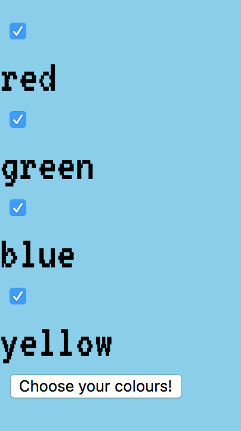
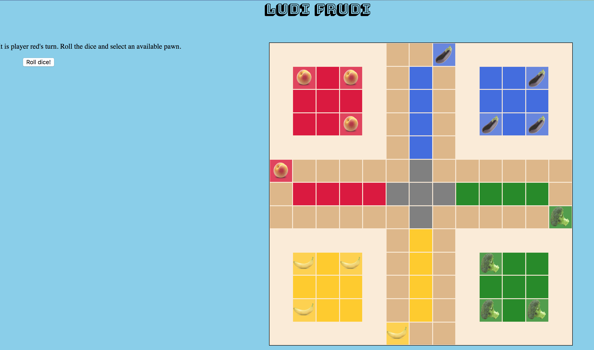
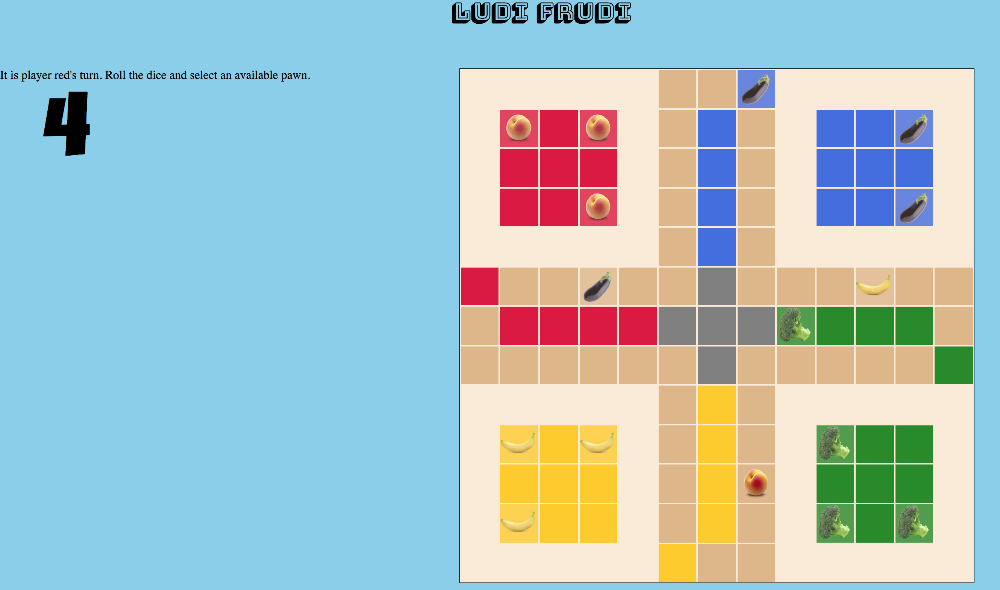

# Project: Ludi Frudi - Browser Game

This is a browser game based on the popular board game Ludo. It models and tests the game logic and then displays it in the browser for a user to interact with.

This group project is designed to illustrate an understanding of:

* Object oriented and functional programming with vanilla JavaScript
* Test Driven Development
* Web Programming (PubSub)

The project was built using only:

* HTML / CSS
* Vanilla JavaScript
* Express

We were **NOT** allowed to use:

* Any Object Relational Mapper (e.g. ActiveRecord)
* Any pre-built CSS libraries, such as Bootstrap
* Authentication

## Brief

#### MVP
 - Render a board and a pawn
 - Render a dice view and PubSub a random value between 1 and 6 to the pawn to move
 - Handle the pawn finish situation.

#### Extensions
 - Implement the full game logic

 There are three components this game uses: an info view to guide the players, a dice view which tells the pawns how much they can move and the board with pawns (where all the magic happens).

 The first action in the game is for the players to select their colours. This is the first event listener which PubSubs the array of colours which will make up the players.

 The rest of the game logic happens within this initial subscription. See the [game model](https://github.com/LauraNgy/Project_02_Ludo_Game/blob/master/client/src/models/game.js) for more details.

 The main learning point of this project personally was that a subscription within another subscription is a bad idea if it can be avoided. Therefore, the code went through a major refactor to avoid this very thing.

The main fix was introducing an object which stored all the properties which were previously published. The responsibility for building this object was passed to the [game view](https://github.com/LauraNgy/Project_02_Ludo_Game/blob/master/client/src/views/game_view.js).

*Screenshot of the colour select form*

*Screenshot of the game in its initial state*

*Screenshot during a game*
